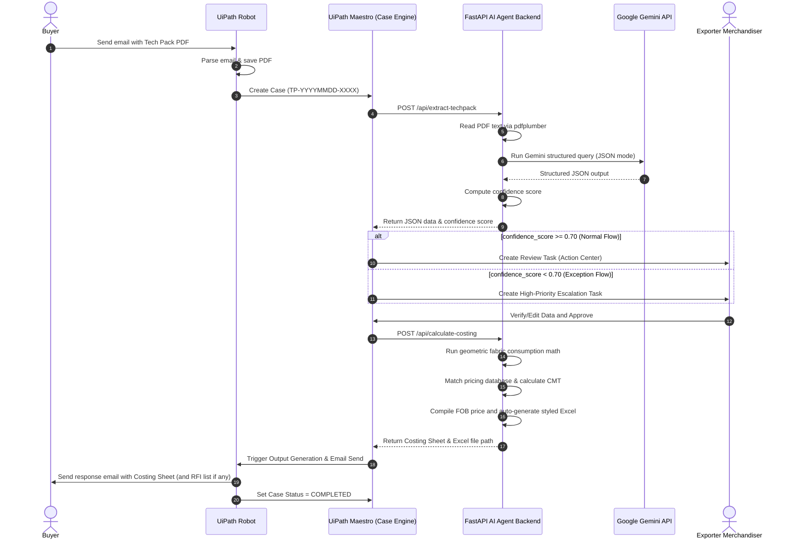

# System Architecture Document

This document outlines the detailed system architecture, component integrations, data contracts, and logical flows for the AI-Powered Garment Tech Pack Case Management System.

---

## System Integration Diagram



---

## Detailed Data Contracts

### 1. Extraction Request (`POST /api/extract-techpack`)
*Payload Schema*:
```json
{
  "case_id": "TP-20260523-0001",
  "pdf_url": "string - path or URL to tech pack PDF"
}
```

*Response Schema (`ExtractionResponse`)*:
```json
{
  "case_id": "TP-20260523-0001",
  "status": "SUCCESS",
  "confidence_score": 0.88,
  "data": {
    "style_name": "Classic Polo Shirt",
    "style_number": "FB-2026-P001",
    "garment_type": "Polo Shirt",
    "fabric_composition": "100% Cotton Pique",
    "fabric_gsm": 200,
    "fabric_width": 60,
    "color_variants": ["White", "Navy", "Black", "Red"],
    "size_range": "S, M, L, XL",
    "measurements": {
      "chest": {"S": 38, "M": 40, "L": 42, "XL": 44},
      "length": {"S": 27, "M": 28, "L": 29, "XL": 30},
      "sleeve": {"S": 8, "M": 8.5, "L": 9, "XL": 9.5},
      "shoulder": {"S": 16, "M": 17, "L": 18, "XL": 19}
    },
    "bill_of_materials": [
      {"item": "Main fabric - Cotton Pique", "unit": "yards", "consumption_per_piece": 1.8},
      {"item": "Rib fabric - collar/cuffs", "unit": "yards", "consumption_per_piece": 0.3}
    ],
    "construction_details": {
      "seam_type": "French seam on side seams, overlock on sleeves",
      "stitch_density": "12-14 SPI",
      "special_processes": ["Enzyme wash"]
    },
    "clarification_questions": [
      "Please confirm collar stand interlining specifications."
    ],
    "low_confidence_fields": []
  },
  "next_action": "HUMAN_REVIEW"
}
```

### 2. Costing Request (`POST /api/calculate-costing`)
*Payload Schema (`CostingRequest`)*:
```json
{
  "case_id": "TP-20260523-0001",
  "style_data": {
    "style_name": "Classic Polo Shirt",
    "style_number": "FB-2026-P001",
    "garment_type": "Polo Shirt",
    "fabric_composition": "100% Cotton Pique",
    "fabric_width": 60,
    "measurements": {
      "chest": {"S": 38, "M": 40, "L": 42, "XL": 44},
      "length": {"S": 27, "M": 28, "L": 29, "XL": 30}
    },
    "bill_of_materials": [
      {"item": "Main fabric - Cotton Pique", "unit": "yards", "consumption_per_piece": 1.8},
      {"item": "Rib fabric - collar/cuffs", "unit": "yards", "consumption_per_piece": 0.3}
    ]
  },
  "order_quantity": {
    "S": 1000,
    "M": 1500,
    "L": 1200,
    "XL": 800
  }
}
```

*Response Schema (`CostingResponse`)*:
```json
{
  "case_id": "TP-20260523-0001",
  "status": "SUCCESS",
  "excel_filepath": "C:\\...\\outputs\\costing_sheet_TP-20260523-0001.xlsx",
  "costing_sheet": {
    "style_name": "Classic Polo Shirt",
    "style_number": "FB-2026-P001",
    "costing_date": "2026-05-22",
    "currency": "USD",
    "fabric_consumption": {
      "main_fabric_yards_per_piece": 1.98,
      "fabric_width_inches": 60,
      "garment_type_factor": "Polo Shirt"
    },
    "material_cost_breakdown": [
      {"item": "Main fabric - Cotton Pique", "consumption": 1.98, "unit": "yards", "rate": 4.5, "cost": 8.91},
      {"item": "Rib fabric - collar/cuffs", "consumption": 0.36, "unit": "yards", "rate": 3.2, "cost": 1.15}
    ],
    "total_material_cost": 10.06,
    "cmt_cost": 3.2,
    "factory_cost_per_piece": 13.26,
    "markup_percentage": 15,
    "fob_price_per_piece": 15.25,
    "order_quantity": {
      "S": 1000, "M": 1500, "L": 1200, "XL": 800, "total": 4500
    },
    "total_order_value": 68625.0,
    "notes": [
      "Main fabric consumption calculated dynamically using geometric body specification math."
    ]
  }
}
```
